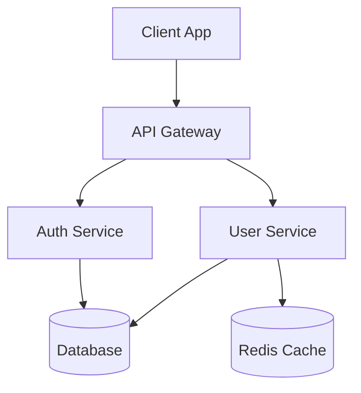

# Documentation Generator Skill

## Capabilities
- API documentation generation
- README file creation
- Code documentation extraction
- Markdown formatting
- Diagram generation (Mermaid)
- Changelog management

## Documentation Types

### 1. API Documentation
See references/api-template.md

### 2. README Template
See references/readme-template.md

### 3. Architecture Diagram (Mermaid)

## Best Practices
1. Keep documentation close to code
2. Use consistent formatting
3. Include examples for everything
4. Update docs with code changes
5. Version documentation
6. Use diagrams for complex concepts
