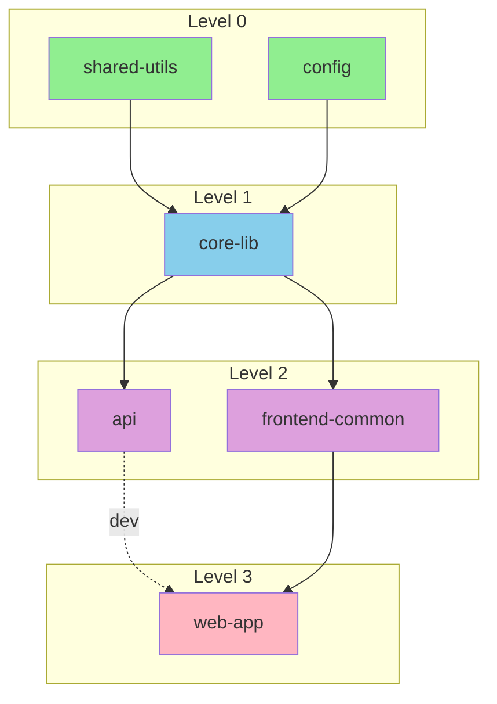
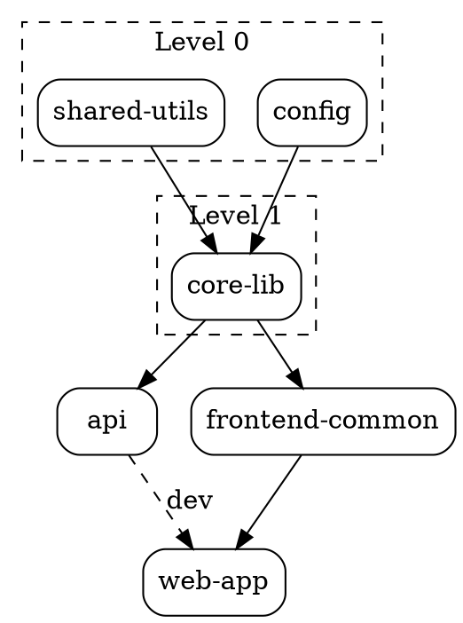

# Dependency Graph Visualization

의존성 그래프를 터미널과 다양한 형식으로 시각화하는 가이드입니다.

## 터미널 시각화

### ASCII 트리 형식

```
my-monorepo
├── shared-utils (v1.0.0)
│   └── (no dependencies)
├── core-lib (v2.1.0)
│   └── shared-utils
├── api (v1.5.0)
│   ├── core-lib
│   └── express
├── frontend-common (v1.2.0)
│   ├── core-lib
│   └── react
└── web-app (v3.0.0)
    ├── frontend-common
    ├── api (dev)
    └── vite (dev)
```

### 빌드 레벨 시각화

```
Build Order Visualization
═════════════════════════

Level 0 ─────────────────────────────────────────────
  ┌──────────────┐    ┌──────────┐
  │ shared-utils │    │  config  │
  └──────┬───────┘    └────┬─────┘
         │                 │
Level 1 ─┼─────────────────┼─────────────────────────
         ▼                 ▼
    ┌────────────────────────┐
    │       core-lib         │
    └───────────┬────────────┘
                │
Level 2 ────────┼────────────────────────────────────
         ┌──────┴──────┐
         ▼             ▼
  ┌──────────┐  ┌─────────────────┐
  │   api    │  │ frontend-common │
  └────┬─────┘  └────────┬────────┘
       │                 │
Level 3────────────────────────────────────────────
       └────────┬────────┘
                ▼
        ┌─────────────┐
        │   web-app   │
        └─────────────┘
```

### 의존성 매트릭스

```
Dependency Matrix
═══════════════════════════════════════════════════════════

              shared  core   api  frontend  web
              utils   lib         common    app
            ┌──────┬──────┬─────┬─────────┬─────┐
shared-utils│  -   │      │     │         │     │
core-lib    │  ●   │  -   │     │         │     │
api         │      │  ●   │  -  │         │     │
frontend    │      │  ●   │     │    -    │     │
web-app     │      │      │  ○  │    ●    │  -  │
            └──────┴──────┴─────┴─────────┴─────┘

● = production dependency
○ = dev dependency
```

## Mermaid 다이어그램



## DOT 형식 (Graphviz)



## JSON 형식 (D3.js 호환)

```json
{
  "nodes": [
    { "id": "shared-utils", "level": 0, "size": 10 },
    { "id": "config", "level": 0, "size": 5 },
    { "id": "core-lib", "level": 1, "size": 25 },
    { "id": "api", "level": 2, "size": 40 },
    { "id": "frontend-common", "level": 2, "size": 30 },
    { "id": "web-app", "level": 3, "size": 50 }
  ],
  "links": [
    { "source": "shared-utils", "target": "core-lib", "type": "prod" },
    { "source": "config", "target": "core-lib", "type": "prod" },
    { "source": "core-lib", "target": "api", "type": "prod" },
    { "source": "core-lib", "target": "frontend-common", "type": "prod" },
    { "source": "api", "target": "web-app", "type": "dev" },
    { "source": "frontend-common", "target": "web-app", "type": "prod" }
  ]
}
```

## 시각화 옵션

### 표시 설정

```yaml
display_options:
  # 노드 표시
  nodes:
    show_version: true
    show_size: false      # 파일 크기
    show_deps_count: true

  # 엣지 표시
  edges:
    show_version_constraint: false
    differentiate_dev: true
    highlight_circular: true

  # 레이아웃
  layout:
    direction: "top-to-bottom"  # 또는 "left-to-right"
    spacing: "auto"
    group_by_level: true
```

### 필터링

```yaml
filters:
  # 의존성 타입
  dependency_types:
    production: true
    development: false
    peer: true
    optional: false

  # 패키지 필터
  packages:
    include: ["*"]
    exclude: ["@types/*"]

  # 깊이 제한
  max_depth: 3

  # 외부 의존성 숨김
  hide_external: true
```

### 하이라이트

```yaml
highlighting:
  # 특정 패키지 강조
  focus_package: "api"

  # 경로 강조
  highlight_path:
    from: "shared-utils"
    to: "web-app"

  # 문제 강조
  problems:
    circular: "red"
    outdated: "yellow"
    vulnerable: "orange"
```

## 인터랙티브 기능

### 터미널 인터랙션

```yaml
terminal_interaction:
  # 키보드 단축키
  shortcuts:
    expand: "Enter"
    collapse: "Backspace"
    filter: "/"
    export: "e"
    quit: "q"

  # 노드 선택
  selection:
    method: "arrow_keys"
    action_on_select: "show_details"
```

### 드릴다운 상세

```
Package: api (v1.5.0)
═══════════════════════════════════════

Path: packages/api
Files: 45
Size: 1.2MB

Dependencies (3):
  ● core-lib ^2.0.0
  ● express ^4.18.0
  ● cors ^2.8.5

Dependents (2):
  ○ web-app (dev)
  ○ mobile-app (dev)

Scripts:
  build: tsc -p tsconfig.build.json
  test: jest
  dev: nodemon

[b] Build  [t] Test  [d] Dependencies  [q] Back
```

## 내보내기 형식

```yaml
export_formats:
  - name: "svg"
    description: "벡터 이미지"
    tool: "graphviz"

  - name: "png"
    description: "래스터 이미지"
    tool: "graphviz"

  - name: "html"
    description: "인터랙티브 웹 페이지"
    tool: "d3.js"

  - name: "json"
    description: "데이터 형식"
    tool: "native"

  - name: "markdown"
    description: "문서용 (Mermaid)"
    tool: "native"
```
