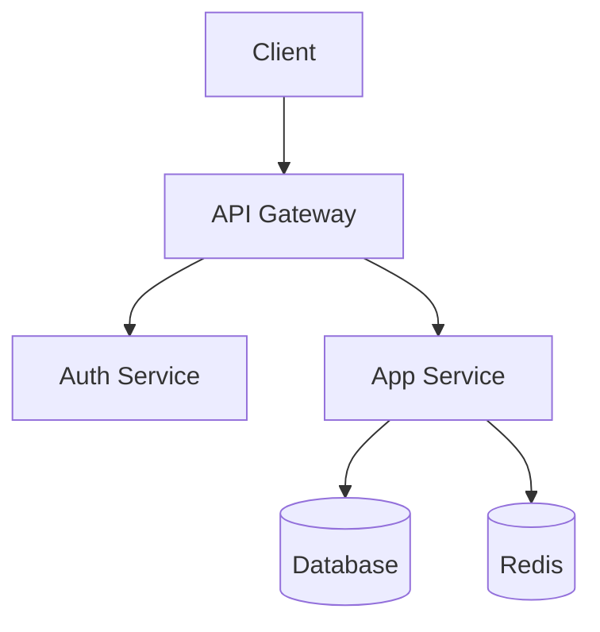

# Documentation Generator Skill

## Capabilities
- API documentation generation
- README file creation
- Code documentation (JSDoc/docstrings)
- Architecture diagrams (Mermaid)
- Changelog management

## API Documentation Template

```markdown
# API Reference

## Base URL
`https://api.example.com/v1`

## Authentication
Bearer token required: `Authorization: Bearer <token>`

## Endpoints

### GET /resource
Description of the endpoint.

**Parameters:**
| Name | Type | Required | Description |
|------|------|----------|-------------|
| page | int | No | Page number (default: 1) |
| limit | int | No | Items per page (default: 20) |

**Response (200):**
```json
{ "data": [], "meta": { "total": 0, "page": 1 } }
```

**Errors:**
- 401: Unauthorized
- 404: Not found
- 429: Rate limited
```

## README Template

```markdown
# Project Name

## Overview
Brief description.

## Quick Start
Installation and setup steps.

## Usage
Basic usage examples.

## API Reference
Link to full API docs.

## Contributing
Contribution guidelines.

## License
License info.
```

## Architecture Diagram (Mermaid)



## Best Practices
1. Keep docs close to code
2. Use consistent formatting
3. Include examples for everything
4. Update docs with code changes
5. Use diagrams for complex concepts
